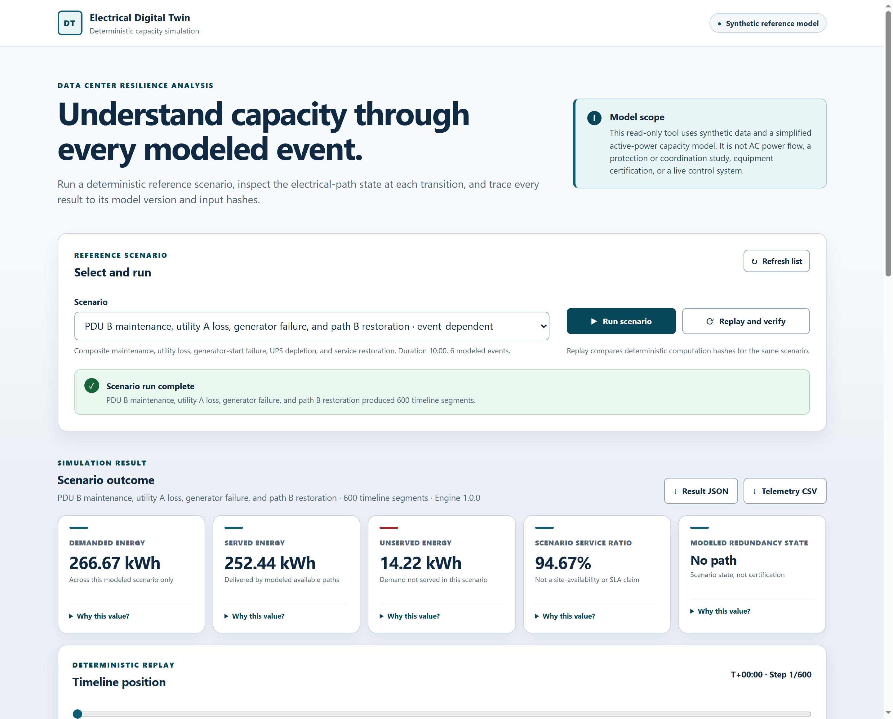

# dc-twin

[](https://github.com/NishikawaButterfly/dc-twin/actions/workflows/ci.yml)

dc-twin is a deterministic, capacity-constrained simulator for synthetic data-center electrical architectures. The name is a repo slug, not a claim: nothing here connects to a live facility. You give it a versioned design snapshot and a scenario of failures, maintenance windows, and transfers. It returns a timeline of which loads stayed served, which paths carried the power, when each UPS ran down, and what caused every alarm.

I work around data-center electrical systems, and I wanted a way to reason about redundancy and failure timelines without bringing any real site information into public code. Everything in this repository is synthetic and hand-authored. The goal is to make event ordering and capacity consequences reviewable, not to model any real facility.

To be clear about scope: this is not AC power flow, a short-circuit or protection-coordination study, a safety analysis, a Tier assessment, or a live operational twin. It simulates lossless active power against capacity constraints, and nothing else.



## What it does

- Models utilities, generators, ATS/STS, transformers, switchgear, UPS units, PDUs, and loads as a directed acyclic topology, and reports a modeled redundancy state (2N, single path, battery backed, and so on) for each timeline segment.
- Applies failure, restoration, maintenance, load-step, generator-outcome, and atomic-transfer events in a deterministic order, with explicit tie-breaks for equal-time events.
- Allocates power with an integer max-flow pass over component and connection ratings, in `(priority, service_order, component_id)` order.
- Records SHA-256 replay and state hashes plus a formula-level explanation for each metric, so the same inputs and model version reproduce the same result hash.
- Serves stored runs through a read-only FastAPI application, a dependency-free web page, and immutable PostgreSQL records with Alembic migrations. The API exposes only the bundled reference scenarios and accepts no arbitrary topology.

The simulation kernel imports no web or database framework. Contracts, the full model rules, and the two [architecture decision records](adr/) are documented under [docs/](docs/).

## Example scenario

The bundled `REF-DC-2N-001` fixture is a fictional ten-minute run on a 2N topology: two 2 MW paths, two 800 kW dual-cord loads, and two UPS systems with 120 kWh of usable energy each. Path B goes into planned maintenance, then path A loses its utility and its generator fails to start, so UPS A carries the full 1.6 MW until it is empty. Service returns when the loads transfer back to the restored path B.

| Result | Value |
| --- | ---: |
| Demanded energy | 266.7 kWh |
| Served energy | 252.4 kWh |
| Unserved energy | 14.2 kWh |
| Scenario service ratio | 94.7% |
| UPS A discharge | 120.0 kWh |
| Low-energy alarm | 336 s |
| Battery depleted | 390 s |
| Service restored | 422 s |
| Interruption | 32 s |
| Stranded capacity during the outage | 1.6 MW |

The engine computes energy internally as exact integer millijoules (watts times milliseconds), so the table shows rounded views of exact integers. The service ratio describes this artificial ten-minute run only. It is not annual availability, an SLA, MTBF, or an uptime claim. The hand calculation behind each number lives in [docs/REFERENCE_SCENARIO.md](docs/REFERENCE_SCENARIO.md), and the expected values are committed independently of the engine in [`examples/synthetic/expected/reference-metrics.json`](examples/synthetic/expected/reference-metrics.json).

## Quick start

With Docker (Engine plus Compose v2):

```powershell
Copy-Item .env.example .env
# Replace both placeholder passwords in .env first.
docker compose --env-file .env up --build --wait
```

Open [http://127.0.0.1:8000](http://127.0.0.1:8000). PostgreSQL stays inside the Compose network and is not published to the host. The API container runs as a non-root user on a read-only filesystem. `docker compose down` stops the stack and keeps the database volume.

Or run the CLI directly (Python 3.12 or newer):

```powershell
python -m venv .venv
.\.venv\Scripts\python -m pip install -e ".[test]"
dc-twin validate-design examples/synthetic/reference-2n.snapshot.json
dc-twin validate-scenario examples/synthetic/reference-2n.snapshot.json examples/synthetic/scenarios/composite-failure.scenario.json
dc-twin run examples/synthetic/reference-2n.snapshot.json examples/synthetic/scenarios/composite-failure.scenario.json --output results/composite.json
dc-twin replay examples/synthetic/reference-2n.snapshot.json examples/synthetic/scenarios/composite-failure.scenario.json results/composite.json
```

`replay` re-runs the simulation and checks the stored computation hash. The CLI refuses to overwrite an existing result unless you pass `--force`. API routes, error format (RFC 9457 Problem Details), and health endpoints are described in [docs/API.md](docs/API.md).

## Tests

```powershell
python scripts/check_contracts.py
python scripts/check_reference_results.py
python -m unittest discover -s tests -v
node --check web/app.js
```

CI additionally runs Ruff, strict mypy, branch-coverage gates on the calculation kernel, Linux and Windows test jobs, PostgreSQL migration and persistence tests, package build and wheel smoke tests, dependency audit, CodeQL, dependency review, and a Compose smoke test against the hardened stack.

## Limitations

The synchronous v1 envelope is bounded before simulation starts: at most 250 components, 500 connections, 1,000 external events, 10,000 timeline segments, 250,000 telemetry points, a 1 MiB input document, and a seven-day horizon.

The model is lossless active power only. There is no voltage, frequency, reactive power, power factor, or efficiency. No short-circuit currents, protection settings, arc flash, harmonics, or transients. No thermal or mechanical behavior, no probabilistic reliability, and no economics. Nothing connects to real equipment (no Modbus or SCADA), and no result implies code compliance, construction suitability, or an Uptime Institute Tier rating. Read [docs/MODEL_SPECIFICATION.md](docs/MODEL_SPECIFICATION.md) and [docs/THREAT_MODEL.md](docs/THREAT_MODEL.md) before interpreting a result.

All public data is synthetic. The repository contains no customer topology, site identifiers, operational telemetry, or client-derived ratings, and every sample declares `data_classification: "synthetic"`. See [docs/DATA_PROVENANCE.md](docs/DATA_PROVENANCE.md).

## Documentation

- [Architecture](docs/ARCHITECTURE.md) and the [architecture decision records](adr/)
- [Model specification](docs/MODEL_SPECIFICATION.md)
- [Reference scenario](docs/REFERENCE_SCENARIO.md)
- [API](docs/API.md), [Operations](docs/OPERATIONS.md), [Test matrix](docs/TEST_MATRIX.md)
- [Threat model](docs/THREAT_MODEL.md) and [Data provenance](docs/DATA_PROVENANCE.md)
- [Roadmap](ROADMAP.md) and [Changelog](CHANGELOG.md)

## Contributing and license

See [CONTRIBUTING.md](CONTRIBUTING.md) and the [Code of Conduct](CODE_OF_CONDUCT.md) before opening a change. Report vulnerabilities privately as described in [SECURITY.md](SECURITY.md).

Licensed under the [MIT License](LICENSE).
