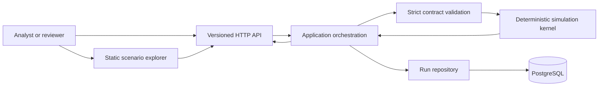
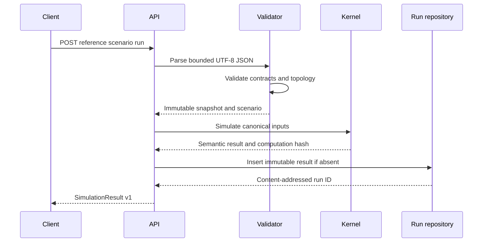

# Architecture

## Purpose

The Data Center Electrical Digital Twin is a deterministic software reference for exploring how a simplified, synthetic electrical capacity topology responds to explicit events. It turns a versioned design snapshot and scenario into a traceable timeline, metrics, alarms, and synthetic telemetry.

The word *twin* describes the software representation and replay workflow. It does not imply a live connection to a facility or engineering equivalence to the physical power system.

## System context

There is no connector to SCADA, BMS, PLC, protection relay, ATS, STS, UPS, generator controller, or other operational technology. Telemetry is generated from simulation state and always carries `quality=synthetic`.

## Architectural layers

### Versioned boundary contracts

The JSON Schemas in `contracts/` define the public snapshot, scenario, and result envelopes. Parsing is strict: unknown fields, duplicate JSON keys, non-finite numbers, broken references, unsupported versions, and bounded-resource violations are rejected before simulation.

`ElectricalDesignSnapshot` is the integration-boundary pattern for an upstream design tool. It is a data contract, not a shared database, ORM model, authentication domain, or runtime dependency. This keeps design authoring and dynamic scenario execution independently deployable. The public version 1 contract accepts synthetic data only; any real private integration requires a separately governed contract version and must not relabel its data.

### Deterministic domain kernel

The domain layer contains immutable input models, a mutable state object scoped to one run, topology validation, canonical hashing, deterministic event processing, and an integral maximum-flow capacity allocator. It has no dependency on HTTP or persistence.

Stable ordering, integer base units, explicit tie-breaks, and canonical hashing make replay testable. The kernel does not read wall-clock time, random state, environment-specific locale, or database-generated identifiers when computing semantic results.

### Application and API

The application layer loads bundled reference inputs, invokes the kernel, converts the semantic result to the public contract, and coordinates persistence. FastAPI exposes `/api/v1` resources and operational health endpoints. Errors use stable machine-readable codes and do not disclose stack traces to clients.

### Persistence

PostgreSQL stores input hashes, the engine version, canonical result payloads, and run metadata. Version 0.1.0 derives `run_id` from the computation hash, so an identical result is content-addressed to the same immutable row. Replay recomputes and compares hashes without mutating or inserting over the historical payload.

Database migrations are managed by Alembic. The domain kernel remains usable without a database, which keeps equation-level tests fast and makes persistence failures separable from model failures.

### User interface

The static browser interface consumes only the versioned API. It visualizes reference topology, event sequence, served and unserved load, alarms, battery state, and synthetic telemetry. Client-side exports are convenience representations; the API result remains the authoritative modeled record.

## Run sequence

## Determinism boundary

The snapshot hash and scenario hash are SHA-256 digests of canonical UTF-8 JSON: keys sorted recursively, compact separators, Unicode preserved, and non-finite values rejected. The computation hash covers the deterministic semantic result and excludes the persistence-generated `run_id` and the computation-hash field itself.

Determinism is scoped to the same canonical inputs and engine version. A model change may intentionally change a computation hash and therefore requires release notes, updated reference evidence, and compatibility review.

## Deployment view

The supported reference deployment uses separate API and PostgreSQL containers on an internal Compose network. Only the API port is intended for local publication. The API performs readiness checks against required dependencies; liveness reports process health only.

The reference stack is not hardened for direct internet exposure. Authentication, authorization, tenant isolation, TLS termination, rate limiting, centralized secrets, audit retention, and network policy are responsibilities of the production integration boundary. See [Operations](OPERATIONS.md), [Security](../SECURITY.md), and [Threat Model](THREAT_MODEL.md).

## Quality attributes

- **Auditability:** every metric links to formulas, inputs, events, and state hashes.
- **Determinism:** integer arithmetic and stable ordering remove platform-dependent ambiguity from modeled outcomes.
- **Fail-closed validation:** unsupported or impossible topologies do not produce plausible-looking results.
- **Replaceable adapters:** HTTP and PostgreSQL can evolve without changing domain equations.
- **Bounded execution:** payload, topology, event, horizon, and output limits constrain resource use.
- **Honest scope:** every public surface distinguishes capacity simulation from electrical engineering analysis and live control.

## Extension rules

A new component or event type requires a versioned contract change, parser and semantic validation, deterministic state-transition rules, positive and negative tests, independent reference calculations, API documentation, and an architecture decision record. Live telemetry ingestion or control would require a separate product and safety architecture; it must not be added as an adapter to this reference kernel.
