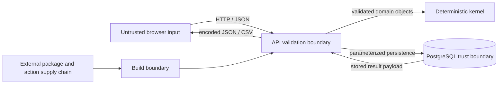

# Threat Model

## Scope

This threat model covers the public reference application: static browser assets, versioned HTTP API, deterministic simulation kernel, run persistence, PostgreSQL, container configuration, and the synthetic examples in this repository.

It does not claim that the reference stack is suitable for an internet-facing or multi-tenant deployment. It explicitly excludes operational-technology integration because the application has no live equipment connector and must not be extended into a control path without a separate safety and security architecture.

## Assets and security objectives

| Asset | Objective |
|---|---|
| Snapshot and scenario inputs | Integrity, bounded parsing, explicit synthetic provenance |
| Simulation semantics | Determinism, fail-closed validation, reproducible calculations |
| Stored run records | Integrity, availability, traceability, appropriate retention |
| Computation and state hashes | Unambiguous canonicalization and replay evidence |
| Database credentials | Confidentiality and least privilege |
| API and host resources | Availability under bounded workloads |
| Browser users | Protection from untrusted stored or reflected content |
| Project reputation | No misleading engineering, certification, or control claims |

## Trust boundaries

All client input is untrusted. Stored payloads remain untrusted when rendered or exported. A database connection is trusted only for availability and transaction semantics, not as proof that a payload is safe to display.

## Threats and controls

| Threat | Relevant controls in the reference design | Residual or deployment requirement |
|---|---|---|
| Oversized JSON, event floods, topology explosions | Byte, component, connection, event, horizon, and output limits; bounded schemas; early rejection | Add gateway request limits, rate limits, quotas, timeouts, and workload isolation before shared deployment |
| Ambiguous JSON or hash confusion | Duplicate-key rejection; non-finite-number rejection; canonical UTF-8 serialization; versioned SHA-256 inputs | Hashes prove byte-independent canonical equality, not authorship; sign artifacts where provenance assurance is required |
| Broken, cyclic, or misleading topology | Reference validation, DAG enforcement, terminal-load rule, source-paralleling rejection | Semantic validation cannot prove a real topology is accurate or safe |
| Non-deterministic replay | Integer base units; stable ID ordering; explicit event priority; engine version; computation hash | Changed engine semantics require versioning and updated reference evidence |
| SQL injection or unsafe persistence | ORM/parameterized access and strict domain serialization | Use least-privilege database roles; review any future raw SQL separately |
| Unauthorized read or run creation | None in the local reference application | Do not expose directly; add authentication, authorization, tenant scoping, audit logs, and object-level access checks at a trusted gateway/application boundary |
| Stored or reflected script execution | JSON APIs; text-safe UI rendering should avoid raw HTML insertion | Maintain a restrictive Content Security Policy and test every future rich-text feature |
| CSV formula injection | Telemetry fields are enumerated and synthetic; exported identifiers are bounded | Prefix or reject formula-leading free text if future CSV exports include user-supplied labels |
| Secret disclosure | No credentials in examples; environment-based configuration; ignored local environment files | Use a secret manager, rotate credentials, redact logs, and prohibit secrets in issue reports |
| Sensitive facility-data publication | Contract requires `data_classification=synthetic`; provenance policy; fictional fixtures | Classification is not a data-loss-prevention system; human review and repository secret/data scanning remain mandatory |
| Dependency or CI compromise | Pinned dependency versions, locked action revisions, build and audit checks | Review updates, minimize permissions, generate provenance/SBOM, and use trusted registries for production |
| Database tampering or record replacement | Input, state, and computation hashes; append-oriented run model; replay comparison | SHA-256 is not a keyed integrity control; use immutable audit storage or signatures for adversarial environments |
| Log injection or sensitive logging | Stable error codes and structured logging should avoid raw payloads | Centralize logs, encode fields, redact secrets, and define retention before production |
| Misuse as an engineering or control tool | Repeated scope warnings, synthetic quality marker, no equipment connector | Organizational review and user training are still required; software text cannot prevent intentional misuse |

## High-risk abuse cases

### Publishing a real topology as "synthetic"

An actor could relabel customer or facility data and commit it. Schema validation cannot establish provenance. Repository review must reject recognizable site identifiers, addresses, asset serials, network endpoints, SCADA tags, incident timestamps, customer names, tender text, or values sourced from a real design. When origin is uncertain, do not publish.

### Treating a modeled transfer as a safe switching instruction

An atomic-transfer event only changes edges in a graph. It does not evaluate synchronization, interlocks, protection, fault duty, transient response, equipment condition, operating procedures, or personnel safety. UI and API consumers must preserve this distinction and must not label outputs as commands or recommendations.

### Resource exhaustion with a valid-looking graph

Even schema-valid inputs can create expensive path structures or large result sets. The application therefore needs both structural limits and execution time/output limits. A shared deployment should run simulations in isolated workers with per-job quotas rather than relying only on request timeouts.

### Cross-run access in a hosted service

Run IDs are not authorization tokens. A future hosted service must bind every read, replay, and export to an authenticated principal and tenant. Guess-resistant IDs alone are insufficient.

## Assumptions

- The host, container runtime, and database platform are patched and administered by trusted operators.
- Production database traffic is confined to a private network and protected in transit where it crosses hosts.
- Dependency sources and CI credentials are governed outside the application.
- Public repository examples remain fictional and are reviewed before merge.
- The application has no route to operational equipment.

## Residual risk and review triggers

The principal residual risks are misuse of simplified results, accidental publication of sensitive topology data, unauthenticated exposure, and resource exhaustion. Revisit this threat model before adding user-uploaded files, authentication, multiple tenants, external queues, cloud object storage, richer HTML, real telemetry ingestion, probabilistic workloads, or any operational-technology connectivity.
